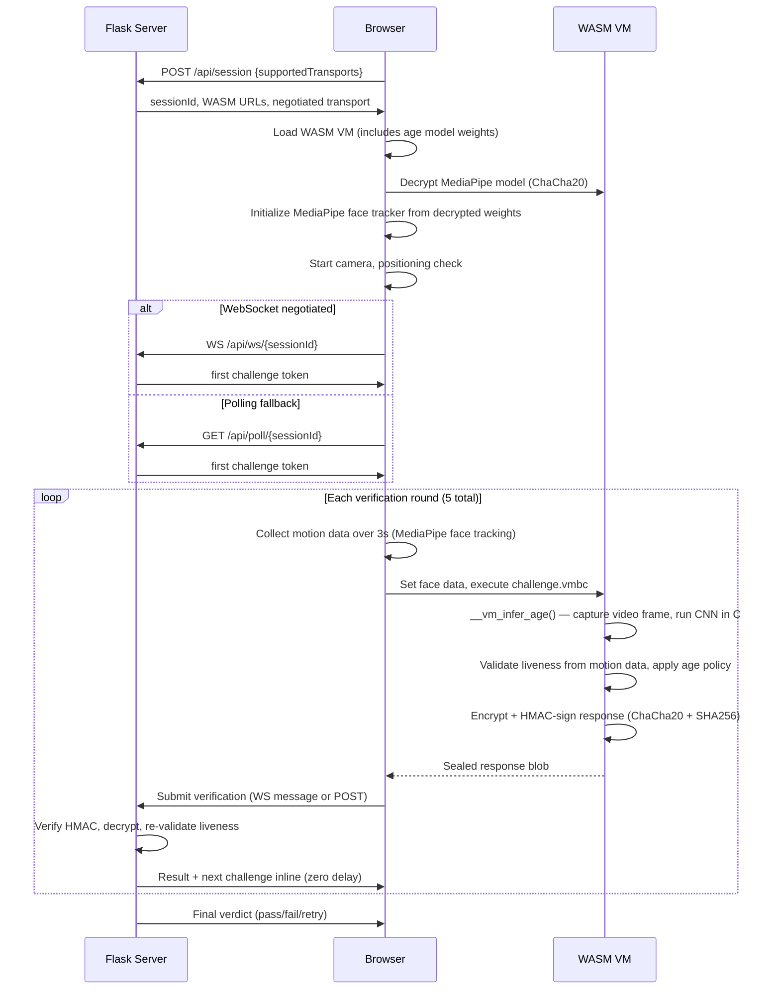

# OpenAge

Privacy-first age verification with cryptographic attestation. All decision logic — liveness validation, age policy, challenge assembly — runs as encrypted bytecode inside a polymorphic WASM virtual machine. Age estimation runs entirely in compiled C code inside the WASM module with model weights embedded in the binary — no browser JS can intercept or fake inference results. Face tracking for liveness uses MediaPipe with server-side dual validation. No face data leaves the device. The server rebuilds the entire stack every 10 minutes with fresh keys.

## Quick Start

```bash
git submodule update --init
source /path/to/emsdk/emsdk_env.sh
pip install -r requirements.txt
python server.py
```

Open http://localhost:8000. On first launch, the server builds a polymorphic WASM VM (requires Emscripten SDK + Python 3), downloads the MediaPipe model (~5 MB), converts age model weights to C, and compiles everything into the WASM binary. Models are cached locally after the first download.

## Architecture



## Security Model

### What Runs in the VM

| Component            | Location                  | Why                                    |
| -------------------- | ------------------------- | -------------------------------------- |
| Age inference (CNN)  | Compiled C in WASM binary | Tamper-proof — no browser JS involved  |
| Age model weights    | Embedded in WASM binary   | Cannot substitute or intercept         |
| Frame capture        | C code via EM_ASM         | Reads video element directly from WASM |
| Liveness validation  | Encrypted bytecode        | Tamper-proof decision logic            |
| Age policy decisions | Encrypted bytecode        | Cannot modify thresholds               |
| Suspicion detection  | Encrypted bytecode        | Cannot bypass anti-spoofing            |
| Face tracking (GPU)  | Browser MediaPipe         | Requires WebGL; server dual-validates  |

### Age Inference Pipeline

The age estimation model (face-api.js TinyXception architecture) is reimplemented as a C inference engine compiled into the WASM binary:

1. **Build time**: Python script extracts uint8-quantized weights from the face-api.js model shard, dequantizes to float32, generates a C byte array (~1.7 MB)
2. **Compilation**: Model data compiled to `.o` object (cached), linked into the WASM module alongside the CNN forward-pass code
3. **Runtime**: When `__vm_infer_age()` is called from the VM bytecode, the C code:
    - Captures the video frame directly via `EM_ASM` (no JS intermediary)
    - Center-crops 70% and bilinear-resizes to 112×112
    - Runs the full TinyXception forward pass (conv2d, depthwise separable conv, ReLU, max pool, global average pool, fully connected)
    - Returns the age estimate to the encrypted bytecode

The result flows directly from C inference to QuickJS bytecode validation — browser JavaScript never touches the age value.

### Challenge Protocol

1. **Session creation** — server returns session ID, build ID, WASM URLs, encrypted MediaPipe model URL, and export map
2. **Model decryption** — browser fetches encrypted MediaPipe `.enc` file, passes to WASM `vm_decrypt_blob` for ChaCha20 decryption
3. **Motion capture** — browser collects face tracking samples over 3 seconds via MediaPipe, stores as motion history
4. **Transport negotiation** — client sends supported transports at session creation; server selects WebSocket when both sides support it, otherwise long polling; verify responses include the next challenge inline so rounds start with zero delay
5. **VM execution** — bytecode calls `__vm_infer_age()` five times (burst inference matching the demo's approach), computes trimmed mean, reads pre-collected motion data via `__vm_get_face_data()`, validates liveness, applies age policy, detects spoofing
6. **Sealed response** — VM derives ephemeral keys via XOR-unmask, encrypts (ChaCha20), signs (HMAC-SHA256), wipes keys from stack
7. **Dual validation** — server validates liveness independently AND checks the VM's liveness result; both must pass with identical thresholds; round number and integrity field verified
8. **Verdict** — after all rounds, server computes trimmed mean age: pass (≥ 21), fail (< 15), retry (15–21)

### Key Rotation

The server rebuilds every 10 minutes with:

- Fresh 32-byte keys for decrypt, encrypt, and sign
- Re-encrypted MediaPipe model file with the new decrypt key
- New age model data recompiled into the WASM binary
- New `challenge.vmbc` with all logic encrypted
- Unique polymorphic obfuscation (dead code, symbol renaming, control flow flattening)

Old builds retained for active sessions (max 3 concurrent).

### Defense Layers

| Layer              | Protection                                                                                              |
| ------------------ | ------------------------------------------------------------------------------------------------------- |
| Age inference      | Compiled C in WASM binary — cannot monkey-patch, intercept, or fake results from browser JS             |
| WASM binary        | Polymorphic — structurally unique binary every 10 min with new keys, obfuscated symbols, embedded model |
| Challenge bytecode | Liveness validation, age policy, spoofing detection — all as encrypted QuickJS bytecode                 |
| MediaPipe model    | ChaCha20-encrypted per build; only decryptable through WASM VM                                          |
| Embedded keys      | XOR-split across scattered masked/mask pairs; derived just-in-time on stack with immediate wipe         |
| Key decoys         | Raw keys also hidden at random offsets in decoy arrays with double-indirection macros                   |
| Anti-debug         | Timing checks, call sequence validation, execution cap, FNV-1a integrity, poison latch                  |
| Challenge tokens   | HMAC-signed with server secret, nonce + round prevents replay, TTL prevents delay                       |
| VM response        | ChaCha20 + HMAC-SHA256; can only be produced by the actual VM                                           |
| Dual liveness      | Server re-validates liveness independently of VM result; round number verified                          |
| Browser globals    | Face data and bridge exposed via getter-only properties with frozen bridge objects                      |
| Bounding box       | Input values clamped to [0,1] before pixel access                                                       |
| Browser JS         | Thin shell — no verification logic, no age policy, no liveness checks, no age inference                 |

## How It Works

1. **Session** — server creates session, assigns liveness tasks, provides WASM + encrypted MediaPipe model URL
2. **VM boot** — browser loads WASM VM (age model weights are baked into the binary), decrypts MediaPipe model
3. **Camera** — requests front camera, checks lighting/blur
4. **Positioning** — confirms one face is visible and stable via MediaPipe
5. **Challenge rounds** — 5 rounds: each challenge arrives inline from the previous verify response (or via WebSocket push / initial poll) → collects motion over 3s → VM runs `__vm_infer_age()` on live video frame (C inference) → validates liveness from motion data → applies age policy → encrypts + signs response → server re-validates
6. **Decision** — server computes trimmed mean: pass (≥ 21), retry (15–21), fail (< 15)

## File Structure

```
server.py                Flask server, session management, WASM rebuild scheduler
requirements.txt         Flask + cryptography
demo/
  index.html             Browser-only demo (GitHub Pages)
  style.css              Same responsive dark theme
  app.js                 Client-side orchestration with local liveness + age estimation
  camera.js              getUserMedia, frame capture, quality checks
  face-tracker.js        MediaPipe GPU wrapper
  model-store.js         CDN model fetcher with CacheStorage
  age-estimator.js       face-api.js age/gender estimation
  liveness.js            Client-side liveness challenge checks
  policy.js              Age threshold decision logic
wasm/
  challenge.js           Challenge logic (liveness, age policy, spoofing)
  src/
    vm_bridge.c          QuickJS bridge, vm_decrypt_blob, frame capture, age inference intrinsic
    vm_inference.c       C CNN inference engine (TinyXception forward pass)
    vm_inference.h       Inference API header
    vm_crypto.c          ChaCha20, SHA256, HMAC-SHA256
    vm_antidbg.c         Anti-debug system
  scripts/
    build.js             Polymorphic WASM builder + model embedding
    compile.js           QuickJS bytecode compiler + ChaCha20 encryption
    embed-models.js      MediaPipe model downloader and encryptor
    convert_model.py     Extracts age model weights → C byte array
  vendor/quickjs/        QuickJS engine (git submodule)
static/
  index.html             Single page UI
  style.css              Responsive dark theme
  app.js                 Thin UI shell: motion capture, delegates to VM
  vm-client.js           WASM loader, model decryption, bridge registration
  camera.js              getUserMedia, frame capture, quality checks
  model-store.js         Decrypts MediaPipe model via WASM
  face-tracker.js        MediaPipe GPU wrapper for liveness tracking
  age-estimator.js       (legacy, unused) face-api.js wrapper
  vm/                    (generated) WASM build output + encrypted models
    models/              Encrypted MediaPipe model (.enc)
```

## API

### POST /api/session

Creates a verification session. Client sends supported transports to negotiate the channel.

Request body (optional):

```json
{
    "supportedTransports": ["websocket", "poll"]
}
```

Omitting the body defaults to polling.

```json
{
    "sessionId": "uuid",
    "buildId": "uuid",
    "wasmJs": "/vm/vm.js",
    "wasmBin": "/vm/vm.wasm",
    "loaderJs": "/vm/loader.js",
    "challengeVmbc": "/vm/challenge.vmbc",
    "rounds": 5,
    "tasks": ["turn-left", "blink-twice", "nod"],
    "exports": { "vm_init": "...", "vm_destroy": "...", "vm_decrypt_blob": "..." },
    "transport": "websocket",
    "models": {
        "mediapipe": { "url": "/vm/models/mediapipe.enc", "size": 4934856 }
    }
}
```

### WS /api/ws/{sessionId}

Bidirectional WebSocket for sessions that negotiated `websocket`. Server sends the first challenge immediately on connect. Client sends verify payloads; server responds with result + next challenge inline.

Challenge message:

```json
{
    "type": "challenge",
    "round": 0,
    "task": "turn-left",
    "token": { "session_id": "...", "nonce": "...", "ttl": 60 },
    "tokenSignature": "hex"
}
```

Verify result message:

```json
{
    "accepted": true,
    "complete": false,
    "round": 1,
    "nextChallenge": { "type": "challenge", "round": 1, "..." }
}
```

### GET /api/poll/{sessionId}

Long-polls for the first challenge (30s timeout). Used only as fallback when WebSocket is unavailable. Subsequent challenges arrive inline in verify responses.

### POST /api/verify/{sessionId}

Submit VM response for verification.

```json
{
  "token": {"..."},
  "tokenSignature": "hex",
  "response": "base64(vmResponse)"
}
```

Returns `{"accepted": true, "complete": false, "round": 1, "nextChallenge": {...}}` or `{"accepted": true, "complete": true, "verdict": {"outcome": "pass"}}`. The `nextChallenge` field contains the next round's challenge inline, eliminating a separate poll round-trip.

## Browser-Only Demo

The `demo/` directory contains a standalone browser-only version deployed to GitHub Pages. It uses the same UI but replaces the WASM VM pipeline with client-side face-api.js age estimation and local liveness checks. No server required — all models load from CDN and cache in the browser.

Both versions use identical validation logic: same liveness thresholds (yaw > 20°, nod > 15°, blink > 0.6, distance > 1.3×), same age policy (pass ≥ 21, fail < 15), same burst estimation with trimmed mean, and same suspicious motion detection. The only difference is where the AI model runs.

|                | Full (static/)                              | Demo (demo/)                  |
| -------------- | ------------------------------------------- | ----------------------------- |
| Age inference  | 5-frame burst in compiled C (WASM)          | 5-frame burst via face-api.js |
| Liveness       | Encrypted bytecode + server dual-validation | Client-side motion checks     |
| Age policy     | Encrypted bytecode (same thresholds)        | Client-side policy.js         |
| Model delivery | ChaCha20-encrypted, WASM-decrypted          | Public CDN, CacheStorage      |
| Server         | Required (Flask)                            | None                          |

The demo is not tamper-resistant — it exists to showcase the UX flow.

## Privacy

- Age inference runs as compiled C inside the WASM binary — no external API calls
- Face tracking runs on-device via MediaPipe (WebGL GPU)
- No camera frames leave the device
- VM responses contain only age estimates and face metrics — no images
- Session data is ephemeral (5-minute TTL)

## Prerequisites

- Python 3.10+
- Node.js 18+
- [Emscripten SDK](https://emscripten.org/docs/getting_started/downloads.html)
- QuickJS source: `git submodule update --init`

## Configuration

| Setting               | Default        | Location                           |
| --------------------- | -------------- | ---------------------------------- |
| Port                  | 8000           | `PORT` env var                     |
| WASM rebuild interval | 10 min         | `REBUILD_INTERVAL` in server.py    |
| Challenge rounds      | 5              | `MAX_ROUNDS` in server.py          |
| Challenge TTL         | 60s            | `CHALLENGE_TTL` in server.py       |
| Session TTL           | 5 min          | `SESSION_TTL` in server.py         |
| Age threshold         | 18 + 3 margin  | `compute_verdict()` in server.py   |
| Transport             | auto-negotiate | WebSocket preferred, poll fallback |

## Browser Support

Requires: getUserMedia, ES modules, WebGL (MediaPipe GPU delegate), WebAssembly. Works in current Chrome, Firefox, Edge, Safari.

## Formatting

```bash
pip install black isort
isort . && black .
npx prtfm
clang-format -i wasm/src/*.c wasm/src/*.h
```

## License

Open source. See LICENSE file.
