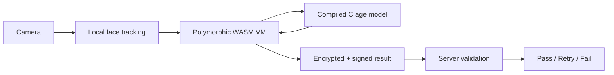
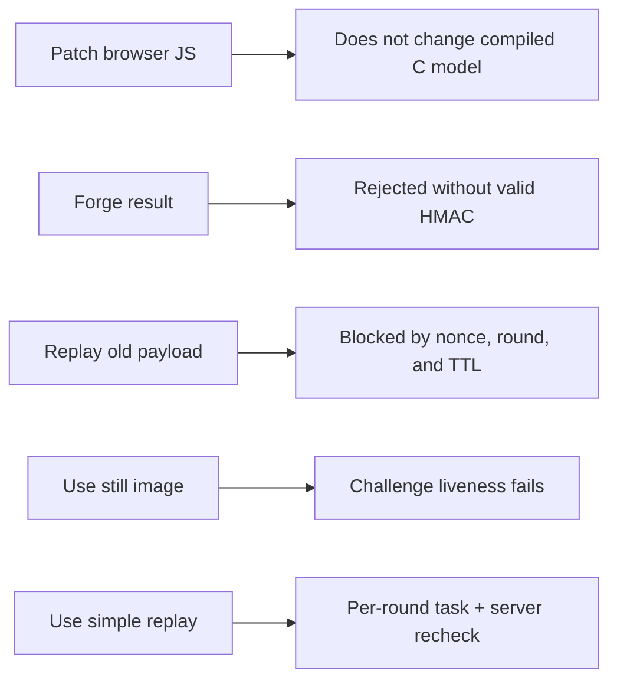
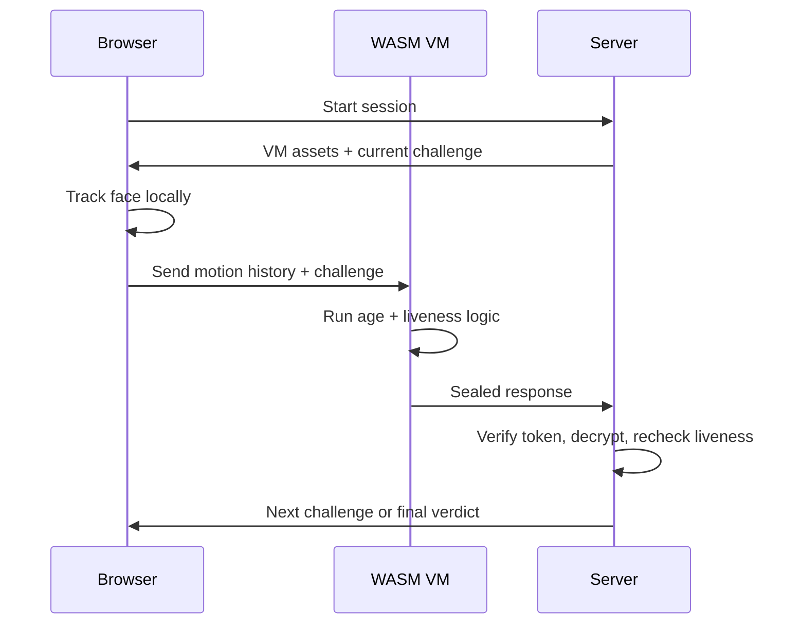

# OpenAge

OpenAge is a privacy-first age check that keeps face processing on the device
but still gives the server something it can verify.

Most age gates are weak in one of two ways: they are trivial to patch in
browser JavaScript, or they send sensitive face data to a backend. OpenAge is
that middle path.

Age inference and liveness evaluation run locally.

Trust comes from compiled code, encrypted VM policy, signed challenges, sealed
responses, and server-side revalidation.

## Why This Project Matters

- It keeps camera data local.
- It avoids trusting plain browser JavaScript.
- It makes simple tampering much harder.
- It makes still images and naive replays much harder to use successfully.
- It shows a practical pattern for local inference with verifiable execution.

## The Idea



The browser handles sensing.

The VM handles trusted client-side logic.

The server accepts only sealed VM output that matches the signed challenge and
passes a second liveness check.

## Why It Is Harder To Fake



This is not perfect anti-spoofing.

It is a stronger trust design than a normal front-end-only check.

## Trust Boundary

| Part            | Where it runs         | Why                                 |
| --------------- | --------------------- | ----------------------------------- |
| Face tracking   | Browser               | Uses local GPU and camera           |
| Age inference   | Compiled C in WASM    | Harder to intercept than JS         |
| Age policy      | Encrypted VM bytecode | Harder to patch in client code      |
| Liveness policy | VM + server           | Client and server must agree        |
| Final verdict   | Server                | The browser is not the trust anchor |

## Verification Flow



Current policy:

- Pass at `>= 18`
- Fail below `15`
- Retry between `15` and `18`
- Require at least `2 of 3` liveness rounds to pass

## Quick Start

```bash
git submodule update --init
source /path/to/emsdk/emsdk_env.sh
pip install -r requirements.txt
python server.py
```

Open `http://localhost:8000`.

The first run builds the WASM VM, embeds the age model, and prepares encrypted
assets.

## Repo Map

- `server.py`: session flow, token signing, VM verification, final verdicts
- `static/`: production web client and WASM loader
- `wasm/`: VM bytecode, C inference, crypto, anti-debug, build pipeline
- `demo/`: browser-only demo without the trust guarantees of the full path

## Properties

- No camera frames are uploaded.
- Age inference stays on device.
- The liveness task is revealed one round at a time.
- The server does not trust raw client claims.
- VM results are encrypted and authenticated.

## Limits

- This raises the cost of spoofing; it does not eliminate spoofing.
- The `demo/` build is for UX only, not security.
- The security model depends on the full VM + server verification path.

## Formatting

```bash
pip install black isort
isort . && black .
npx prtfm
clang-format -i wasm/src/*.c wasm/src/*.h
```

## License

[Apache 2.0](LICENSE)
